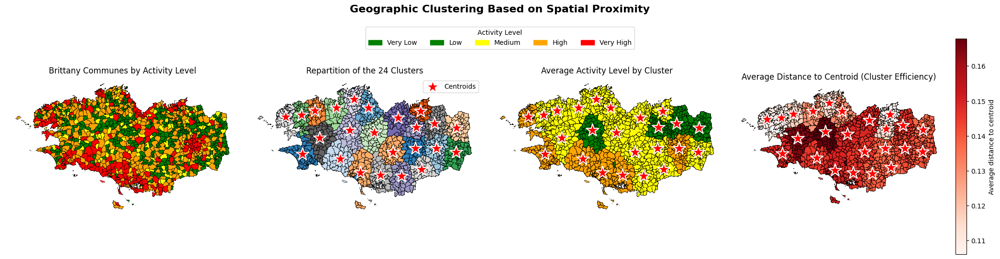
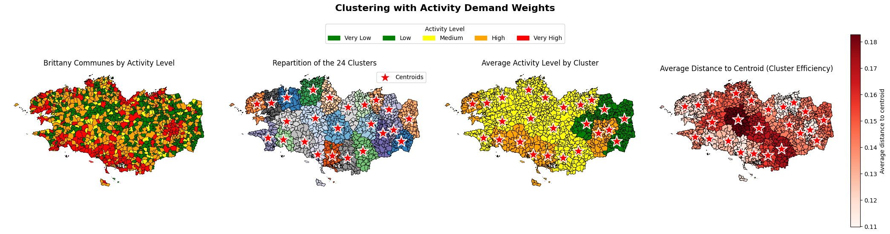
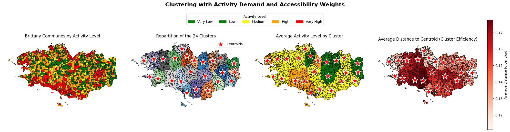
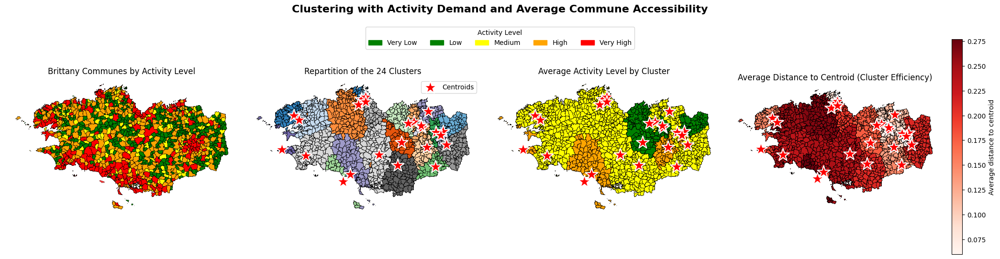
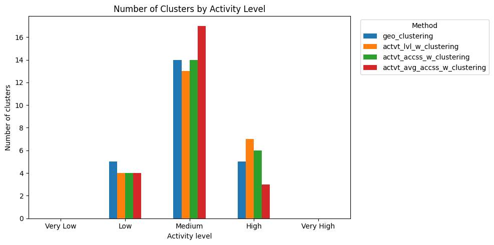
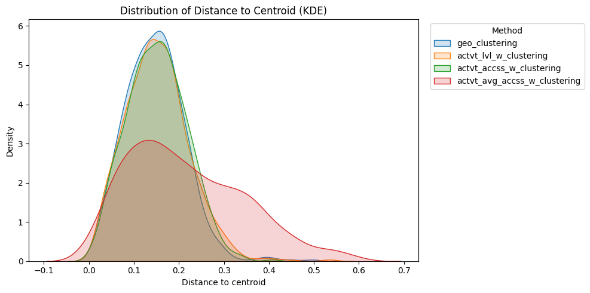

# Optimizing Enedis Operational Base Locations in Brittany (Rennes Data Challenge 2023)

------------------

 

*Enedis is a company that operates and maintains most of the electricity distribution network in France*
- *it does not produce electricity and does not sell it*
- *it focuses only on distribution and reliability of the electrical grid*

 &nbsp;&nbsp; 

 

### Presentation

-------------

The project focuses on optimizing the location of operational bases (OB) for Enedis in the Brittany region.  

The goal is to reduce technician response times by better placing operational bases and assigning communes to them efficiently. This will:
- reduce power outage duration
- improve service quality for customers
- increase team efficiency

 

### Objective

--------------

We will optimize location of operational bases and assign each commune to a base in order to reduce intervention times:
1. each commune must be assigned to exactly 1 operational base
2. travel time between commune and base should not exceed 30 minutes
3. communes have different weights based on intervention activity levels

 

### Approach

We compare several clustering strategies to model how operational bases should be placed across Brittany:
- partitioning communes into $k$ groups
- minimizing within-cluster spatial dispersion and improving operational relevance

|   Approach    |   Model  | Objective Function Minimized  |
|-----|-----------|------|
|  **Baseline geographic clustering**   |    Reference model using only spatial coordinates     Each commune is represented by: $$x_i = (x_i^{lon}, x_i^{lat})$$  |  Standard objective: $$J = \sum_{k=1}^{K} \sum_{i \in C_k} \lVert x_i - \mu_k \rVert^2$$      -  $C_k$: cluster $k$   - $\mu_k$: centroid of cluster $k$   |     
|  **Activity-weighted clustering**    |  Introduces operational demand through weights      Each commune receives a weight: $$w_i = \text{activity\_level}_i$$  | Weighted objective: $$J = \sum_{k=1}^{K} \sum_{i \in C_k} w_i \, \lVert x_i - \mu_k \rVert^2$$     $$\mu_k = \frac{\sum_{i \in C_k} w_i x_i}{\sum_{i \in C_k} w_i}$$  |
| **Activity + accessibility weighting**  |    Introduces travel difficulty between communes     Weight:  $$w_i = \frac{\text{activity\_level}_i}{\text{minutes}_i + \varepsilon}$$     -  $\text{minutes}_i$: travel time from commune $i$    - $\varepsilon$ avoids division by 0   |     $$J = \sum_{k=1}^{K} \sum_{i \in C_k} w_i \, \lVert x_i - \mu_k \rVert^2$$  |
|     **Activity + average accessibility weighting**   |   Uses average accessibility per commune      Average travel time:  $$\bar{t}_i = \frac{1}{\mid N_i \mid} \sum_{j \in N_i} t_{ij}$$       Weight:  $$w_i = \frac{\text{activity\_level}_i}{\bar{t}_i + \varepsilon}$$    |       $$J = \sum_{k=1}^{K} \sum_{i \in C_k} w_i \, \lVert x_i - \mu_k \rVert^2$$  |

 

 
  

    

    

    

    

 

  

    
  

  

    
  

